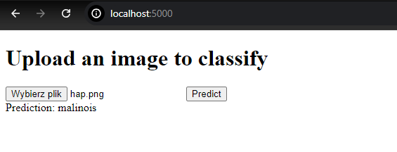
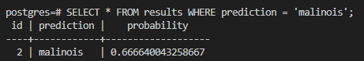

# MLOps Best Practices Project

This project is inspired by book `Practical MLOps_ Operationalizing Machine Learning Models`. 

## Project Overview

It's purpose it's to get familiar with concepts like CI/CD, deploying models with containerization, etc.  
  
This projects creates simple flask app, where you can pass an image to pretrained resnet18 and get prediction. The flask app and attached PostgreSQL db is containerizationed. This project contains tests, a Makefile, and uses GitHub Actions for CI/CD.


## Table of Contents

- [Technologies Used](#technologies-used)
- [Project Structure](#project-structure)
- [Setup and Installation](#setup-and-installation)
- [CI/CD Pipeline](#cicd-pipeline)
- [Testing](#testing)
- [Prediction storing](#Prediction-storing)

## Technologies Used

- Python 
- Docker
- PostgreSQL
- GitHub Actions
- Makefile

- python libraries listed in `requirements.txt`

## Project Structure

```
.
├── .github/            # GitHub Actions workflows
├── app.py              # Main application file
├── create_db.py        # Database scripts
├── docker-compose.yml  # Docker Compose configuration
├── Dockerfile          # Docker build instructions
├── Makefile            # Automation for common tasks
├── requirements.txt    # Python dependencies
├── templates/          # HTML templates (if applicable)
├── tests/              # Test files
```

## Setup and Installation

1. Clone the repository and cd in:

2. Set up the environment:

Add .env file and fill it with essential credidentials for database connection
   ```
    POSTGRES_USER=your_username
    POSTGRES_PASSWORD=your_secure_password
    POSTGRES_DB=your_database_name
    POSTGRES_HOST=localhost
    POSTGRES_PORT=5432
   ```

3. Build and run the Docker containers:
   ```
   docker-compose up -d --build
   ```
4. Connect to `http://localhost:5000/`

5. Pass an image and check the precision



Or run:
```
curl -X POST -F "file=@/path/to/your/image.jpg" http://localhost:5000/predict
```
## CI/CD Pipeline

This project uses GitHub Actions for CI/CD. The pipeline includes:
- secrets to make it work without passing credidentials inside repo
- Automated testing
- Docker building/running based on makefile

## Testing

To run tests locally:

```
make test

```

## Prediction storing

All predictions are stored inside postgresql table named `results`
After running the project and passing an image, to see stored predictions run:
`docker exec -it mlops_learning-db-1 psql -U your_username`
and then `SELECT * FROM results`
Example results: 

They are stored in docker volume, they are not erased after stopping docker.

# TODO
- Make it possible to train your own model and use them inside app
- add more tests
- adjust github actions/makefile to recent major changes in code